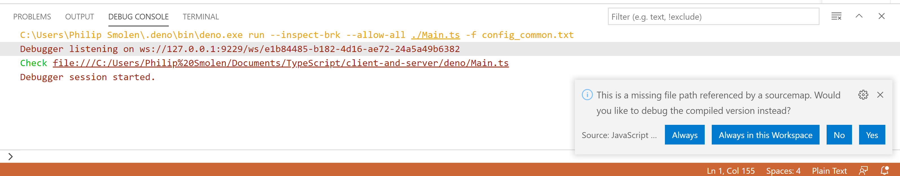

# Deno Client Server Template
This is a template for a standard Deno client/server project.
## Main Idea
Edit client, server, and shared library files all in a single IDE, all in TypeScript. 
## Requirements
 - Use Deno and TypeScript to implement a server.
 - The server mostly talks with the client via HTTP.
 - Use TypeScript to implement the client.
 - Create TypeScript modules shared between the client and the server.
 - Use a single IDE to edit all three types of modules.
 - Intellisense in the editor should use the correct tsconfig file for each directory.
## Current Issues
### Intellisense is flakey at best 😢
Details vary.
Sometimes VS code tells me that the TypeScript service has died 5 times in a row.
Sometimes VS code does no syntax highlighting or suggesting at all.
Usually it makes some attempts, many of which fail, details vary from one run to the next.
The "problems" window and the red marks numbers in the "explorer" panel are similarly unpredictable.

I can set up a simple Deno server or TypeScript client project in VS code without issue.
I run into trouble when I try do both at once.
### What's the best way to compile?
Currently you have to hit control-shit-B to build the project.

TypeScript has a watch option.
And VS Code includes a template for that.
I've never gotten it to work.

Or the server could check for an out of date JavaScript file.
And it could do the build.
### Is there an easier way?
It seems like this shouldn't be so hard.
Am I doing something wrong?
Is there a better way to do this?

Has someone already created this template?

I think this is a pretty common project structure.
Client / Server / Shared.
This is the default template for GWT projects.
### Whatever this is

## Current Status
### Modules
I **can** share modules between client and server.
But those modules **cannot** import other modules.
Either the import statement includes ".ts" or it does not.
Either the client side or the server side will reject the import statement.

I use an unorthodox method of handling the file extension on the client side.
It works.
### Editors
It all falls to pieces if I try to load the workspace.

If I only load the deno directory or the everything-else directory into VS Code, it works.
It's a real pain jumping back and forth, but it works.
### Debugger
The debugger works pretty well!
You can debug the server code right in VS Code.
You can debug the client code in Chrome.
Source maps work, despite the confusing error message to the contrary.
## Bonus Points
Make 2 spaces the default for new files.